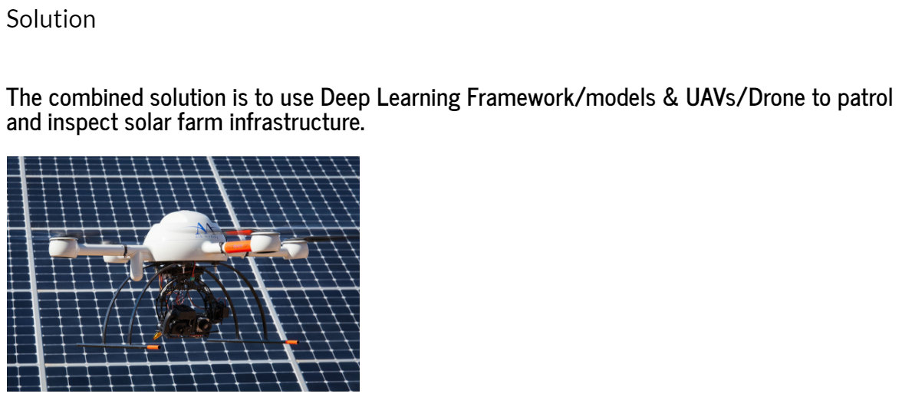
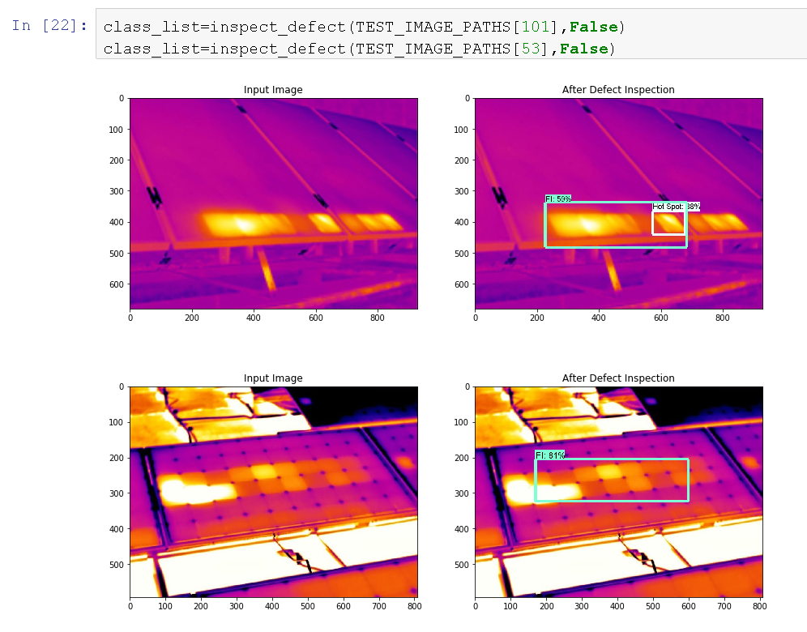

# Automatic-Defect-Inspection-of-Solar-Farm  

  
  

### Below Image shows different types of faults which occur in solar panel and by their thermal images, It can be visually detected !!! 
### Image1:From set of panels, one panel is brighter than rest one of them!! It's Over Heated - OverHeated Components Fault  
### Image2:In a single panel, Middle cells are having different heat variation, its because of short circuit diode - Bypass Diode Fault 
### Image3:There is a bright spot visible which is called HotSpot, It occurs due to dirt,scratches or cracks  
### Image4:It is Zoomed out Image where each small rectangle is panel and we can see bottom panels are yellow in color compared to upper panels, Its bacause of interconnection Fault - Here bootom set of panels are disconnected from power supply.  
### Image5:It is a combination of Hotspot and known as Cluster of Thermal Anamolies  

  

### Below is the process we have used to do fault classification and localization using deep learning technique using Transfer Learning
      

### As we can see,we have provided a test image and our trained model is able to classify what type of fault it is and put a bounding box around it. Here, It is detecting Diode Fault and certain Hotspots  

### This is the extension part where we are showing causes of fault from our knowledge base  

### This is the precautions of fault detected  
 

  
   
  
   

### Misclassification:
### 1.Diode Fault is misclassified as Faulty InterConnections         
### 2.Over Heated Components Fault is misclassified as Hotspot   
### Zoomed Images creates confusion for deep learning model   
### Solution: Train it on large Image set

   
  
 
 ### Conclusion:  
  
### This automatic defect inspection application for solar farms demonstrates that deep learning technology can be applied to solve real-world problems, such as unmanned inspection in harsh or dangerous environments7. The architecture of MobileNet can learn the sophisticated features from the input images for classification and detection tasks. This is a general solution for numerous inspection services in the markets, which can be used for oil and gas inspection, such as pipeline seepage and leakage; utilities inspection, like transmission lines and substations; and even for crisis response to emergencies. The UAVs can fly high up for close-up inspections without putting workers in danger. And the automatic defect inspection system can greatly improve the efficiency of mass data analysis without the help of skilled workers.  

