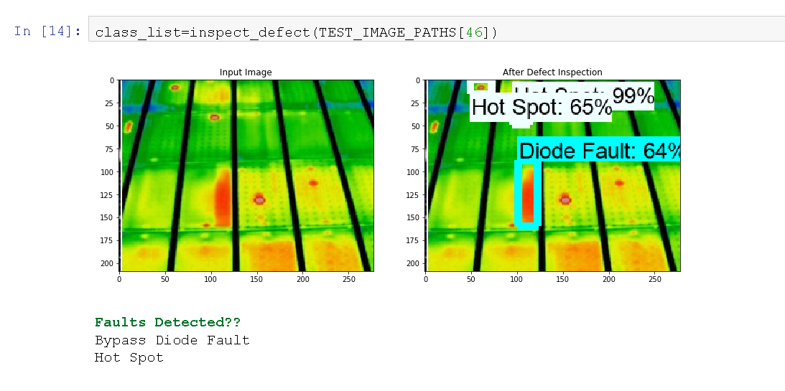
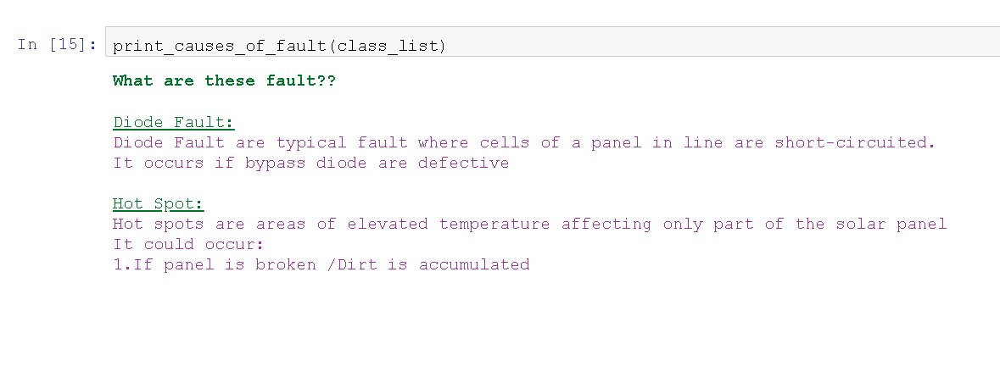
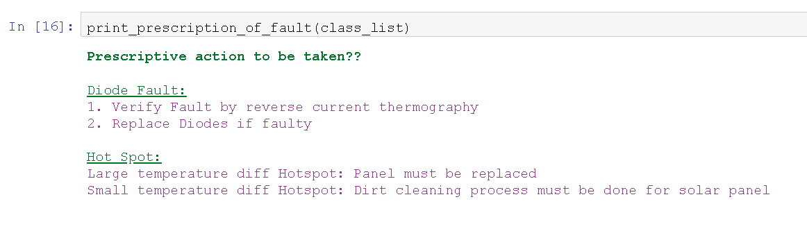
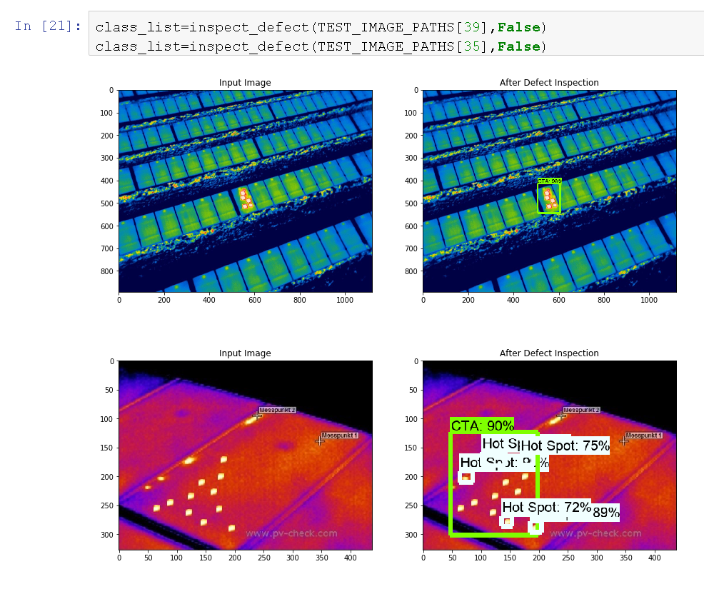
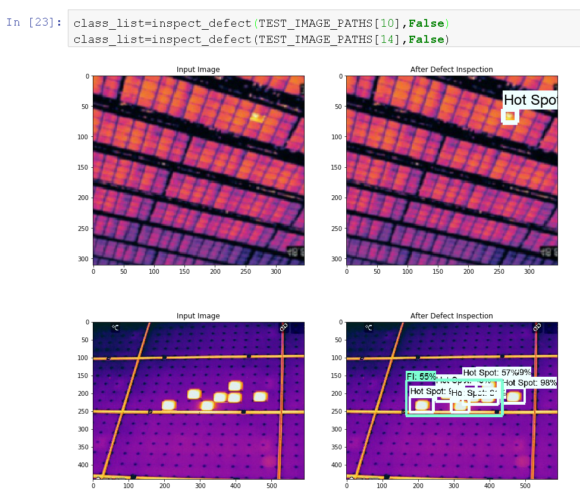

# Automatic-Defect-Inspection-of-Solar-Farm  

  
Conclusion:  
  
This automatic defect inspection application for solar farms demonstrates that deep learning technology can be applied to solve real-world problems, such as unmanned inspection in harsh or dangerous environments7. The architecture of MobileNet can learn the sophisticated features from the input images for classification and detection tasks. This is a general solution for numerous inspection services in the markets, which can be used for oil and gas inspection, such as pipeline seepage and leakage; utilities inspection, like transmission lines and substations; and even for crisis response to emergencies. The UAVs can fly high up for close-up inspections without putting workers in danger. And the automatic defect inspection system can greatly improve the efficiency of mass data analysis without the help of skilled workers.  

